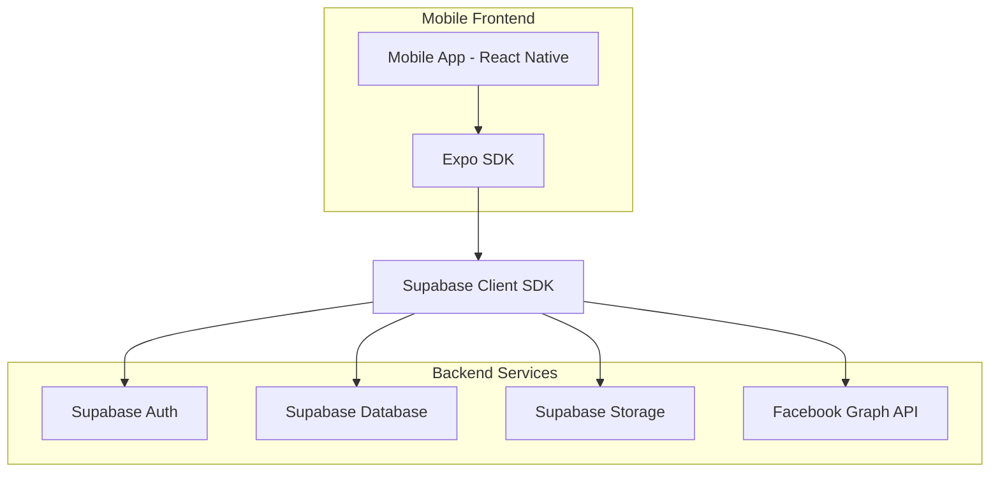
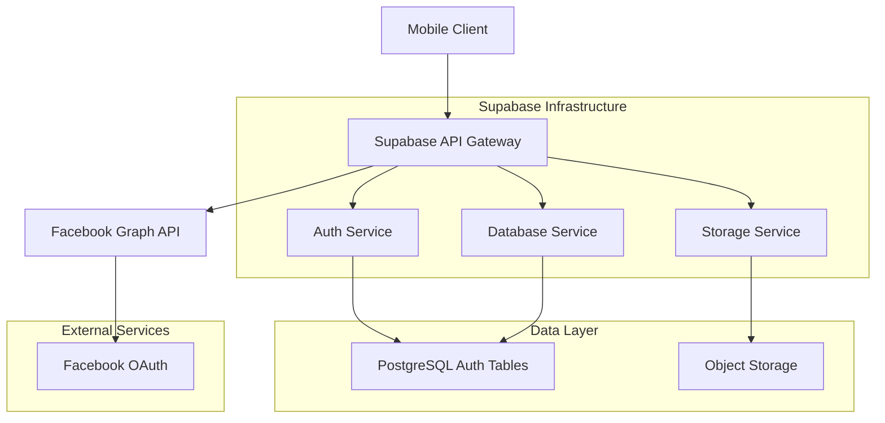
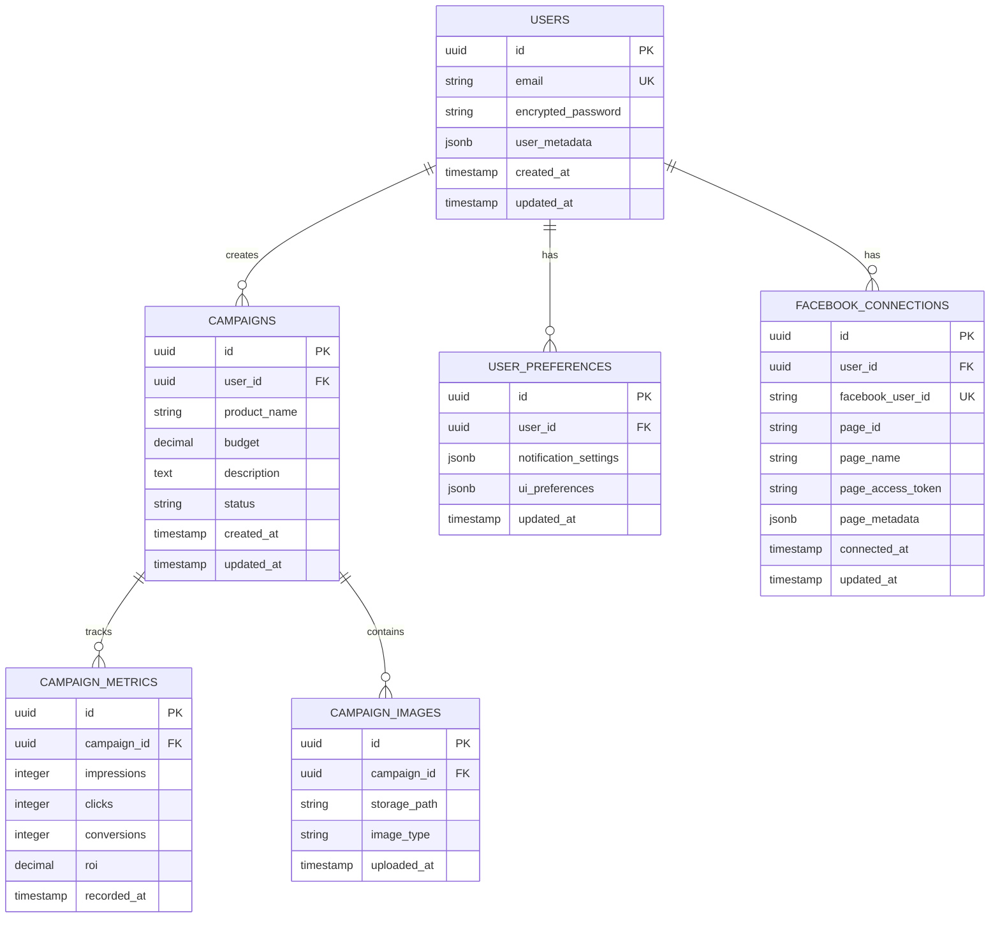

# AdRoom Mobile - Technical Architecture Document

**Note: This Architecture document is for the Standalone Mobile App and supersedes any previous web-based/real-estate specific architecture documents for this specific mobile project.**

## 1. Architecture design



## 2. Technology Description
- **Frontend**: React Native@0.72 + Expo@49 + TypeScript@5
- **Initialization Tool**: expo-cli
- **Backend**: Supabase (PostgreSQL, Auth, Storage)
- **External APIs**: Facebook Graph API v18.0
- **Styling**: NativeWind@2 (Tailwind CSS for React Native)
- **State Management**: React Context + Zustand
- **Navigation**: React Navigation@6
- **Image Processing**: expo-image-picker, expo-file-system

## 3. Route definitions
| Route | Purpose |
|-------|---------|
| /auth/login | User authentication screen - first screen for expired sessions |
| /auth/register | New user registration screen - first screen for new users |
| /facebook/connect | Facebook account connection and page selection for first-time users |
| /dashboard | Main analytics dashboard showing campaign metrics - destination after auth/config |
| /campaign/create | Campaign creation flow with AI assistant |
| /campaign/list | Active campaigns management screen |
| /campaign/:id | Individual campaign details and analytics |
| /settings | User profile and app configuration |

## 4. API definitions

### 4.1 Authentication APIs
```
POST /auth/v1/token?grant_type=password
```

Request:
| Param Name | Param Type | isRequired | Description |
|------------|-------------|-------------|-------------|
| email | string | true | User email address |
| password | string | true | User password |

Response:
```json
{
  "access_token": "eyJhbGc...",
  "token_type": "bearer",
  "expires_in": 3600,
  "refresh_token": "-N9Wyo...",
  "user": {
    "id": "123e4567-e89b-12d3-a456-426614174000",
    "email": "user@example.com"
  }
}
```

### 4.2 Facebook Integration APIs
```
POST /auth/facebook/connect
GET /facebook/pages
POST /facebook/page/select
```

Facebook Connect Request:
| Param Name | Param Type | isRequired | Description |
|------------|-------------|-------------|-------------|
| access_token | string | true | Facebook access token from OAuth |
| user_id | string | true | AdRoom user ID |

Facebook Pages Response:
```json
{
  "pages": [
    {
      "id": "123456789012345",
      "name": "My Business Page",
      "category": "Local Business",
      "access_token": "page_access_token_123"
    }
  ]
}
```

### 4.3 Campaign Management APIs
```
GET /rest/v1/campaigns
POST /rest/v1/campaigns
PUT /rest/v1/campaigns?id=eq.{id}
DELETE /rest/v1/campaigns?id=eq.{id}
```

Campaign Object:
```typescript
interface Campaign {
  id: string;
  user_id: string;
  product_name: string;
  budget: number;
  description: string;
  product_image_url: string;
  status: 'draft' | 'active' | 'paused' | 'completed';
  metrics: {
    impressions: number;
    clicks: number;
    conversions: number;
    roi: number;
  };
  created_at: string;
  updated_at: string;
}
```

## 5. Server architecture diagram



## 6. Data model

### 6.1 Data model definition


### 6.2 Data Definition Language

Users Table (auth.users - managed by Supabase)
```sql
-- Campaigns table
CREATE TABLE campaigns (
  id UUID PRIMARY KEY DEFAULT gen_random_uuid(),
  user_id UUID REFERENCES auth.users(id) ON DELETE CASCADE,
  product_name VARCHAR(255) NOT NULL,
  budget DECIMAL(10,2) NOT NULL CHECK (budget > 0),
  description TEXT,
  status VARCHAR(20) DEFAULT 'draft' CHECK (status IN ('draft', 'active', 'paused', 'completed')),
  created_at TIMESTAMP WITH TIME ZONE DEFAULT NOW(),
  updated_at TIMESTAMP WITH TIME ZONE DEFAULT NOW()
);

-- Campaign metrics table
CREATE TABLE campaign_metrics (
  id UUID PRIMARY KEY DEFAULT gen_random_uuid(),
  campaign_id UUID REFERENCES campaigns(id) ON DELETE CASCADE,
  impressions INTEGER DEFAULT 0,
  clicks INTEGER DEFAULT 0,
  conversions INTEGER DEFAULT 0,
  roi DECIMAL(5,2) DEFAULT 0.00,
  recorded_at TIMESTAMP WITH TIME ZONE DEFAULT NOW()
);

-- Campaign images table
CREATE TABLE campaign_images (
  id UUID PRIMARY KEY DEFAULT gen_random_uuid(),
  campaign_id UUID REFERENCES campaigns(id) ON DELETE CASCADE,
  storage_path TEXT NOT NULL,
  image_type VARCHAR(50) DEFAULT 'product',
  uploaded_at TIMESTAMP WITH TIME ZONE DEFAULT NOW()
);

-- User preferences table
CREATE TABLE user_preferences (
  id UUID PRIMARY KEY DEFAULT gen_random_uuid(),
  user_id UUID REFERENCES auth.users(id) ON DELETE CASCADE,
  notification_settings JSONB DEFAULT '{"push": true, "email": true}',
  ui_preferences JSONB DEFAULT '{"theme": "light", "currency": "USD"}',
  updated_at TIMESTAMP WITH TIME ZONE DEFAULT NOW()
);

-- Facebook connections table
CREATE TABLE facebook_connections (
  id UUID PRIMARY KEY DEFAULT gen_random_uuid(),
  user_id UUID REFERENCES auth.users(id) ON DELETE CASCADE,
  facebook_user_id VARCHAR(255) UNIQUE NOT NULL,
  page_id VARCHAR(255) NOT NULL,
  page_name VARCHAR(255) NOT NULL,
  page_access_token TEXT NOT NULL,
  page_metadata JSONB DEFAULT '{}',
  connected_at TIMESTAMP WITH TIME ZONE DEFAULT NOW(),
  updated_at TIMESTAMP WITH TIME ZONE DEFAULT NOW()
);

-- Create indexes
CREATE INDEX idx_campaigns_user_id ON campaigns(user_id);
CREATE INDEX idx_campaigns_status ON campaigns(status);
CREATE INDEX idx_campaign_metrics_campaign_id ON campaign_metrics(campaign_id);
CREATE INDEX idx_campaign_metrics_recorded_at ON campaign_metrics(recorded_at DESC);
CREATE INDEX idx_user_preferences_user_id ON user_preferences(user_id);
CREATE INDEX idx_facebook_connections_user_id ON facebook_connections(user_id);
CREATE INDEX idx_facebook_connections_facebook_user_id ON facebook_connections(facebook_user_id);

-- Row Level Security (RLS) policies
ALTER TABLE campaigns ENABLE ROW LEVEL SECURITY;
ALTER TABLE campaign_metrics ENABLE ROW LEVEL SECURITY;
ALTER TABLE campaign_images ENABLE ROW LEVEL SECURITY;
ALTER TABLE user_preferences ENABLE ROW LEVEL SECURITY;
ALTER TABLE facebook_connections ENABLE ROW LEVEL SECURITY;

-- Campaign policies
CREATE POLICY "Users can view own campaigns" ON campaigns
  FOR SELECT USING (auth.uid() = user_id);

CREATE POLICY "Users can insert own campaigns" ON campaigns
  FOR INSERT WITH CHECK (auth.uid() = user_id);

CREATE POLICY "Users can update own campaigns" ON campaigns
  FOR UPDATE USING (auth.uid() = user_id);

CREATE POLICY "Users can delete own campaigns" ON campaigns
  FOR DELETE USING (auth.uid() = user_id);

-- Facebook connections policies
CREATE POLICY "Users can view own facebook connections" ON facebook_connections
  FOR SELECT USING (auth.uid() = user_id);

CREATE POLICY "Users can insert own facebook connections" ON facebook_connections
  FOR INSERT WITH CHECK (auth.uid() = user_id);

CREATE POLICY "Users can update own facebook connections" ON facebook_connections
  FOR UPDATE USING (auth.uid() = user_id);

-- Grant permissions
GRANT SELECT ON campaigns TO anon;
GRANT ALL ON campaigns TO authenticated;
GRANT SELECT ON campaign_metrics TO anon;
GRANT ALL ON campaign_metrics TO authenticated;
GRANT SELECT ON campaign_images TO anon;
GRANT ALL ON campaign_images TO authenticated;
GRANT SELECT ON user_preferences TO anon;
GRANT ALL ON user_preferences TO authenticated;
GRANT SELECT ON facebook_connections TO anon;
GRANT ALL ON facebook_connections TO authenticated;
```