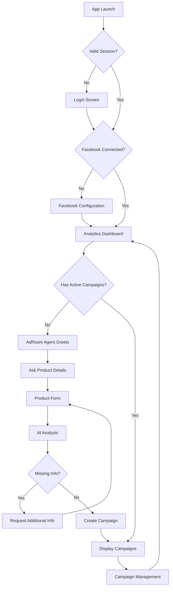

# AdRoom Mobile - Product Requirements Document

**Note: This PRD is for the Standalone Mobile App and supersedes any previous web-based/real-estate specific PRDs for this specific mobile project.**

## 1. Product Overview
AdRoom Mobile is a standalone mobile application for autonomous digital marketing of ANY product or service. It provides businesses with AI-powered autonomous campaign creation and real-time analytics directly from their mobile devices.

The app solves the problem of mobile campaign management by offering an intuitive interface for creating, monitoring, and optimizing advertising campaigns with AI-powered automation, targeting busy business owners and marketers who need to promote any type of product or service (e-commerce items, gadgets, fashion, services, real estate, etc.) away from their desks.

## 2. Core Features

### 2.1 User Roles
| Role | Registration Method | Core Permissions |
|------|---------------------|------------------|
| Business Owner | Email/Phone registration | Create campaigns, view analytics, manage campaigns |
| Premium User | Subscription upgrade | Advanced analytics, product image copy generation, graphic design generation, generated ad video, unlimited access, unified inbox of all social media platforms (Facebook, WhatsApp, Telegram, Instagram, X, LinkedIn, etc.), priority support |

### 2.2 Feature Module
AdRoom Mobile consists of the following main screens:
1. **Login Screen**: User authentication with session management.
2. **Sign Up Screen**: New user registration with email verification.
3. **Facebook Configuration**: Seamless Facebook account connection and page selection where campaign strategy will be executed for new users.
4. **Analytics Dashboard**: Real-time campaign metrics, charts, and performance indicators.
5. **Campaign Creation**: AdRoom AI gets product information from the user and creates a campaign strategy. This strategy comes in two types: "Free" (organic) and "Paid" (includes paid ads). Users approve the preferred campaign type before AdRoom begins to autonomously execute the strategy.
6. **Campaign Management**: List of active campaigns with status and performance data.
7. **Settings**: User profile, notification preferences, and app configuration.

### 2.3 Page Details
| Page Name | Module Name | Feature description |
|-----------|-------------|---------------------|
| Login Screen | Email/Password Login | Authenticate users with email and password, handle session expiration. |
| Login Screen | Session Management | Check for existing valid sessions and auto-login if available. |
| Sign Up Screen | Registration Form | Collect email, password, and basic user information for new accounts. |
| Sign Up Screen | Email Verification | Send verification email and handle confirmation process. |
| Facebook Configuration | Facebook Login | Provide seamless Facebook authentication through in-app native modal. |
| Facebook Configuration | Page Selection | Display user's Facebook pages in a simple list format for easy selection. |
| Facebook Configuration | Authorization Flow | Handle OAuth permissions and store access tokens securely. |
| Analytics Dashboard | Connection Status | Display dynamically what bot is currently doing like "Idle", "Analyzing Product", "Creating Campaign", "Monitoring Performance" etc. |
| Analytics Dashboard | Performance Charts | Show real-time campaign metrics including impressions, clicks, conversions, and ROI. |
| Analytics Dashboard | Quick Actions | Provide shortcuts to create new campaign or view recent campaigns. |
| Campaign Creation | AdRoom Agent Chat | Interactive AI chat interface that greets user and asks "What product would you like to market today?". This is where AdRoom will collect all the user product details it intends to market. |
| Campaign Creation | Campaign Strategy | AdRoom AI creates a strategy based on product info. Two versions: Free (organic) and Paid. User approves one before execution. |
| Campaign Creation | AI Analysis | Analyze uploaded image and title to identify missing information dynamically. |
| Campaign Creation | Dynamic Requirements | Ask specific questions based on AI analysis (e.g., "What sizes do you have for these shoes?" OR "What is the mileage on this car?"). |
| Campaign Management | Active Campaigns List | Display all active campaigns with status indicators and key metrics. |
| Campaign Management | Campaign Controls | Enable pause, resume, or stop campaigns with confirmation dialogs. |
| Settings | User Profile | Manage account information and subscription status. |
| Settings | Notification Preferences | Configure push notifications for campaign alerts and performance updates. |

## 3. Core Process
**User Flow:**
1. User opens AdRoom Mobile app
2. App checks for existing session - shows Login screen if expired, Sign Up if new user
3. After successful authentication, app checks if Facebook is connected
4. If first-time user, shows Facebook Configuration screen
5. User connects Facebook account and selects marketing page through seamless OAuth flow
6. App redirects to Analytics Dashboard
7. AdRoom Agent greets user with welcome message
8. If no active campaigns exist, agent asks "What product would you like to market today?"
9. User provides product details through guided form
10. AI analyzes input and requests additional information if needed (e.g., "What colors are available for this jacket?")
11. Two versions of campaign are created: a free and paid version. User approves preferred campaign type. AdRoom starts to execute campaign strategy. Campaign appears in active campaigns list.
12. User can monitor performance through dashboard analytics

## 4. User Interface Design

### 4.1 Design Style
- **Primary Colors**: Deep blue (#1E40AF) for primary actions, white background
- **Secondary Colors**: Light gray (#F3F4F6) for backgrounds, green (#10B981) for success states
- **Button Style**: Rounded corners with subtle shadows, prominent call-to-action buttons
- **Font**: System fonts (SF Pro for iOS, Roboto for Android) for native feel
- **Layout Style**: Card-based layout with clear visual hierarchy
- **Icons**: Material Design icons for Android, SF Symbols for iOS

### 4.2 Page Design Overview
| Page Name | Module Name | UI Elements |
|-----------|-------------|-------------|
| Login Screen | Authentication Form | Clean input fields with inline validation, "Forgot Password" link, social login options |
| Facebook Configuration | Connect Button | Large, prominent "Connect Facebook Account" button with Facebook branding |
| Facebook Configuration | Page Selection | Simple radio button list of available pages with page profile pictures |
| Analytics Dashboard | Connection Status | Top banner with "Standalone Mode" indicator in amber color |
| Analytics Dashboard | Performance Charts | Line graphs for metrics, circular progress indicators for KPIs |
| Campaign Creation | Agent Chat | Speech bubble interface with typing indicators |
| Campaign Creation | Product Form | Clean input fields with inline validation, image upload with preview |
| Campaign Management | Campaign Cards | Swipeable cards with campaign status badges and quick actions |

### 4.3 Responsiveness
Mobile-first design with touch-optimized interactions. Support for both portrait and landscape orientations. Native platform-specific navigation patterns (bottom tabs for iOS, top tabs for Android where appropriate).

### 4.4 Platform-Specific Considerations
- **iOS**: Native navigation bars, haptic feedback, Face ID/Touch ID integration
- **Android**: Material Design 3 guidelines, adaptive icons, system back button handling
